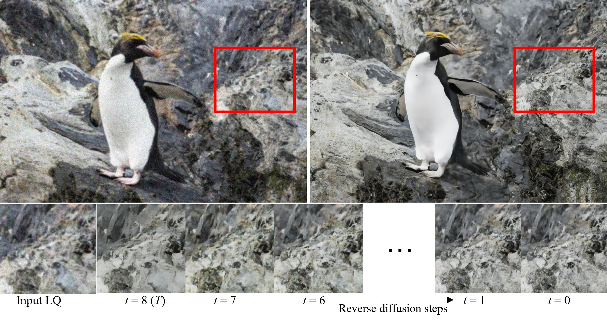
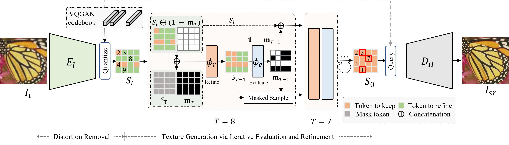

<div align="center">

## [Iterative Token Evaluation and Refinement for Real-World Super-Resolution](https://arxiv.org/abs/2312.05616)

[<sup>1</sup>Chaofeng Chen](https://chaofengc.github.io), [<sup>1</sup>Shangchen Zhou](https://shangchenzhou.com/), [<sup>1</sup>Liang Liao](https://liaoliang92.github.io/homepage/), [<sup>1</sup>Haoning Wu](https://teowu.github.io/), [<sup>2</sup>Wenxiu Sun](https://scholar.google.com/citations?user=X9lE6O4AAAAJ&hl=en), [<sup>2</sup>Qiong Yan](https://scholar.google.com/citations?user=uT9CtPYAAAAJ&hl=en), [<sup>1</sup>Weisi Lin](https://personal.ntu.edu.sg/wslin/Home.html)  
<sup>1</sup>S-Lab, Nanyang Technological University, <sup>2</sup>Sensetime Research

[](https://arxiv.org/abs/2312.05616)  




</div>

-----------------------------



Pipeline of ITER. The input $I_l$ first passes through a distortion removal network $E_l$ to obtain the initially restored tokens $S_l$, which are composed of indexes of the quantized features in the codebook of VQGAN. Then, a reverse discrete diffusion process, conditioned on $S_l$, is used to generate textures. The process starts from completely masked tokens $S_T$. The refinement network (also called the de-masking network) $\phi_r$ generates refined outputs $S_{T-1}$ with $S_l$ as a condition. Then, $\phi_e$ evaluates $S_{T-1}$ to obtain the evaluation mask $m_{T-1}$, which determines the tokens to keep and refine for step $T-1$ through a masked sampling process. Repeat this process $T$ times to obtain de-masked outputs $S_0$, and then reconstruct the restored images $I_{sr}$ using the VQGAN decoder $D_H$. We found that $T=8$ is enough to get good results with ITER, which is much more efficient than other diffusion-based approaches.

## Codes and Weights

Coming soon.

## Citation

If you find this code useful for your research, please cite our paper:
```
@inproceedings{chen2024iter,
  title={Iterative Token Evaluation and Refinement for Real-World Super-Resolution},
  author={Chaofeng Chen and Shangchen Zhou and Liang Liao and Haoning Wu and Wenxiu Sun and Qiong Yan and Weisi Lin},
  booktitle={Proceedings of the AAAI Conference on Artificial Intelligence},
  year={2024},
}
```

## License

<a rel="license" href="http://creativecommons.org/licenses/by-nc-sa/4.0/"></a><br />This work is licensed under a <a rel="license" href="http://creativecommons.org/licenses/by-nc-sa/4.0/">Creative Commons Attribution-NonCommercial-ShareAlike 4.0 International License</a> and [NTU S-Lab License 1.0](./LICENCE_S-Lab).
